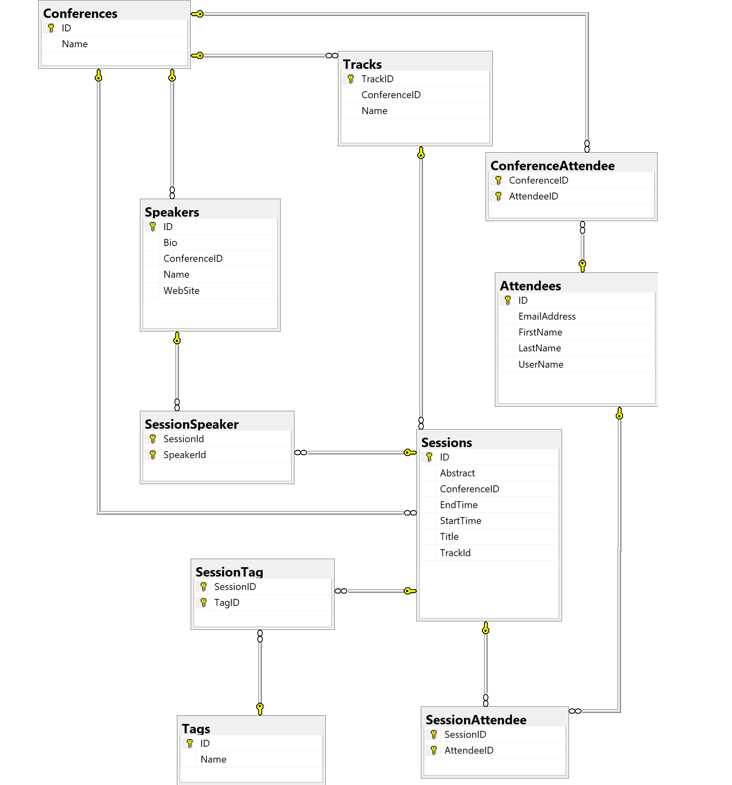

# Challenge #2: Schema & Resolver erstellen

## Ziel

Ziel dieses Workshop ist es End-To-End ein GraphQL Szenarion zu implementieren. Als Client nutzen wir eine React Application und diese bezieht ihre Daten aktuell aus einer REST API. Ziel ist es diese Rest API durch einen GraphQL Server zu ersetzen.

Ihr könnt euch die REST API unter http://localhost:5000/swagger ansehen

Unser Szenario ist das Datenmodell einer Konferenz:

In dieser Challenge wollen wir das Schema und die Resolver für das Schema erstellen.

**Bitte startet mit dem Projekt im `start` Folder und kopiert es euch an einen anderen Ort.**

### Erstellen der Schemas

Auf Basis des Datenbank Diagramms könnt ihr euch einen Überblick über das benötigte Schema verschaffen.

> Als Hilfe ist für **Speaker** bereit der Type, Query und Resolver implementiert. Ihr könnt ihn als Orientierung nutzen.

Erzeugt bitte folgende **Queries**:

- Laden aller Sprecher
- Laden eines Sprechers mit der Id
- Laden aller Teilnehmer
- Lader eines Teilnehmers mit der Id

Erzeugt bitte je einen `type` für:

- Sprecher
- Teilnehmer

> In der `solution.md` findet ihr die Queries und Types. Falls ihr nicht weiterkommt.

## Models & Resolver implementieren

Damit die Queries nun Daten zurückgeben können, benötigt ihr je Query einen Resolver und ein Model was ihr zurückgeben wollt.

1. Erstellt euch für Teilnehmer und Session ein Model im Folder `models`
2. Implementiert für jedes Query einen Resolver der statische Daten zurückgibt.

> Wenn ihr wissen wollte wie die Models aussehen sollen (zu diesem Zeitpunkt) das könnt ihr euch die Rückgabewert der REST API anschauen. http://localhost:5000/swagger

## Ressourcen

- [GraphQL Schema Basics](https://www.apollographql.com/docs/apollo-server/schema/schema/)
- [Resolver](https://www.apollographql.com/docs/apollo-server/data/resolvers/)
